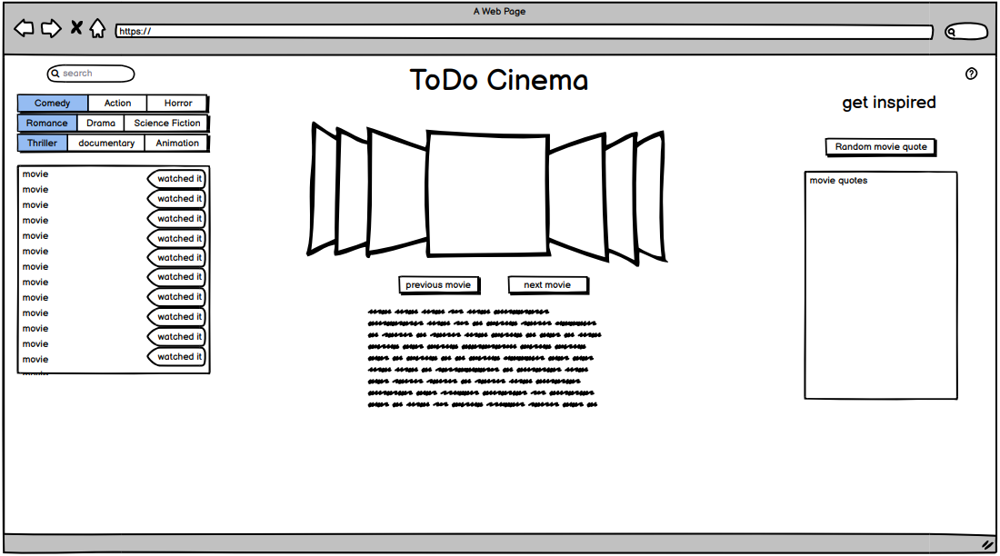

# todo-cinema

## We are creating a webpage that a user can create a ToDo or to watch list of movies and also give the user a random alcoholic/non-alcoholic cocktail to enjoy during the movie.

### As a movie buff I want to keep track of the movies i want to watch and have a cocktail suggestion to go with it. 
### WHEN i search for a movie
### THEN the possible results will be displayed
### WHEN i select a movie
### THEN it will be added to mny list
### WHEN i click the remove button
### THEN the movie will be removed from the list
### WHEN i dont have an exact movie in mind
### THEN the carousel will show suggested movies and info about them
### WHEN i press the random cocktail button 
### THEN i will be presented with a random cocktail

## We are using OMDb api for the movie information and CocktailDB for the random cocktail 
### Task Breakdown 
#### Mikey - search bar
#### Chris - cinema (movie carousel)
#### Payne - randomizer

