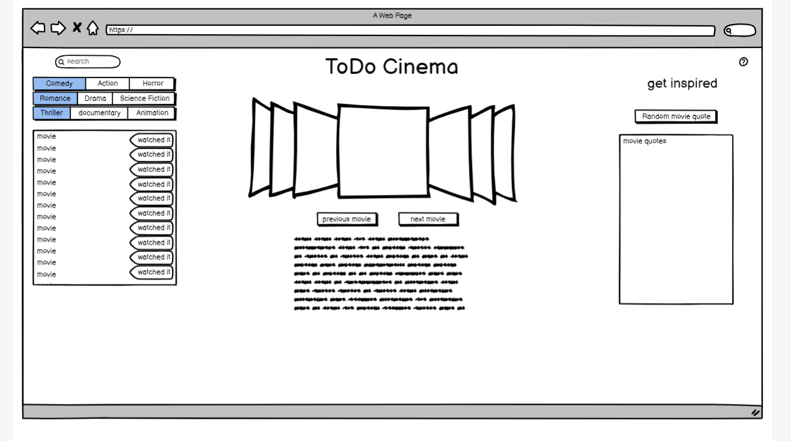

# todo-cinema
## Project Description: User can search for a movie to watch and add that movie to their que. If watched, the user will be able to check the movie was watched or remove it from their list entirely.  (Stretch goal move to archive of movies watched)
## As a user I want to reduce mental load by adding movies to a watch list and removing them once done. In addition, I would like a random cocktail to have with my movie.
### *When I click on a search bar*

*Then I can input text to search for a move*

### *When I click on random cocktail*

*A cocktail will appear accompanied by a relevant picture*

### *When a movie is pulled up*

*Then I can save it to local storage and it will display in my que*

### *When stored movie is clicked*

*Then I can select watched or remove from watchlist*

### *When I want a movie suggestion without searching*

*Then I can scroll through the carousel for suggested movie titles*

## The following APIs will be utilized: OMDb and CocktailDb

## CSS Framework: Materialize

###Project Task Delegation: 

Format: 
